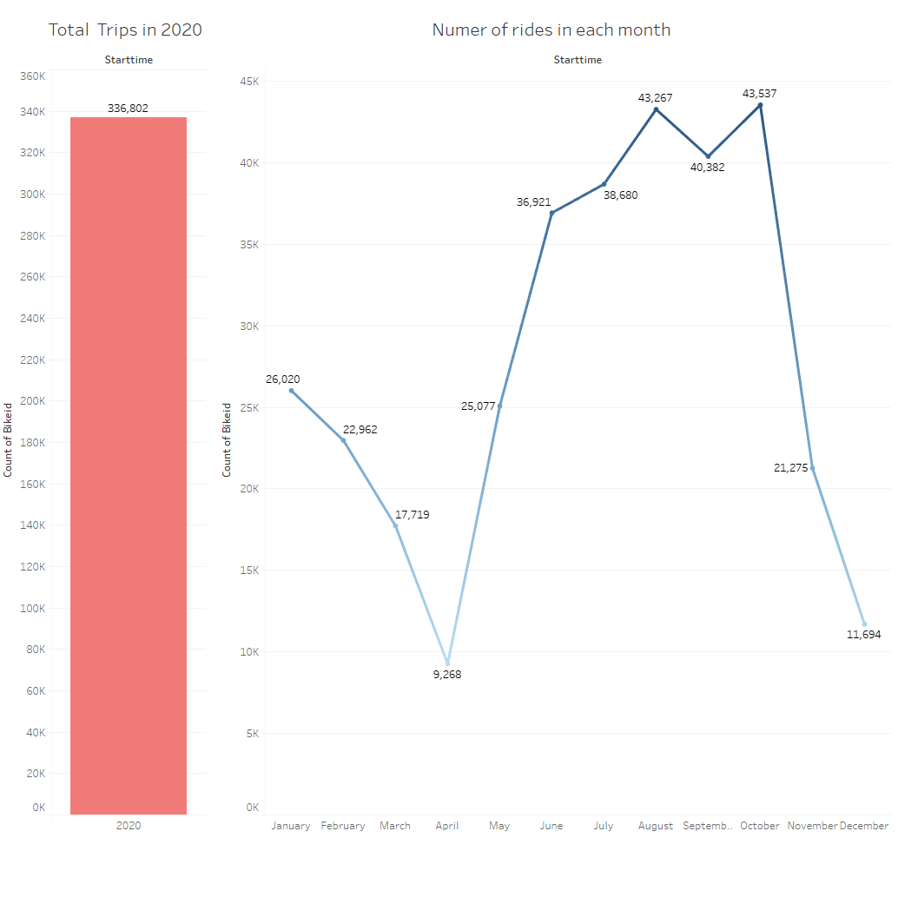
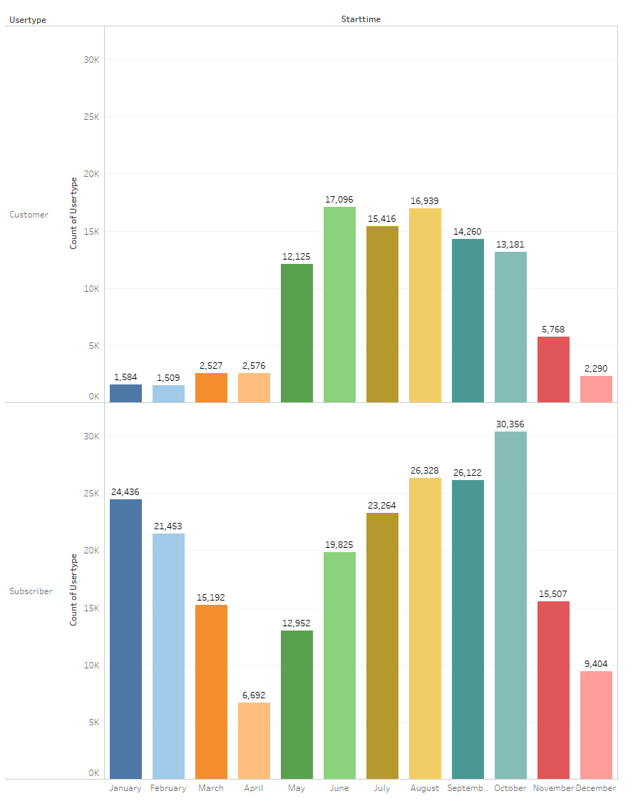
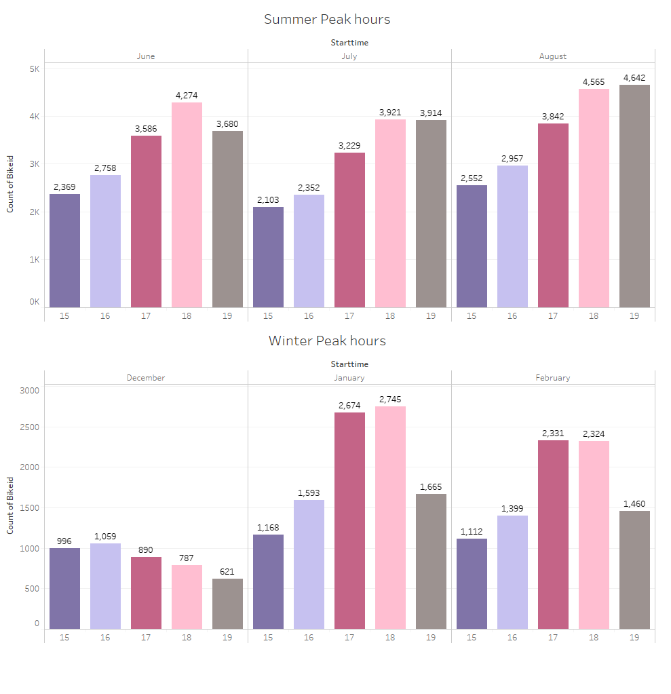
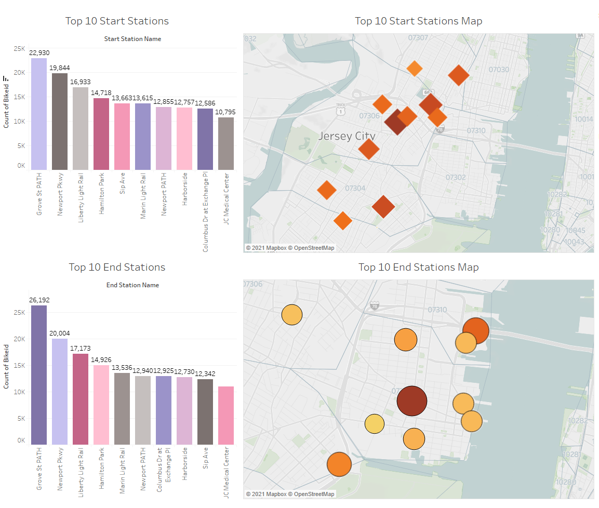
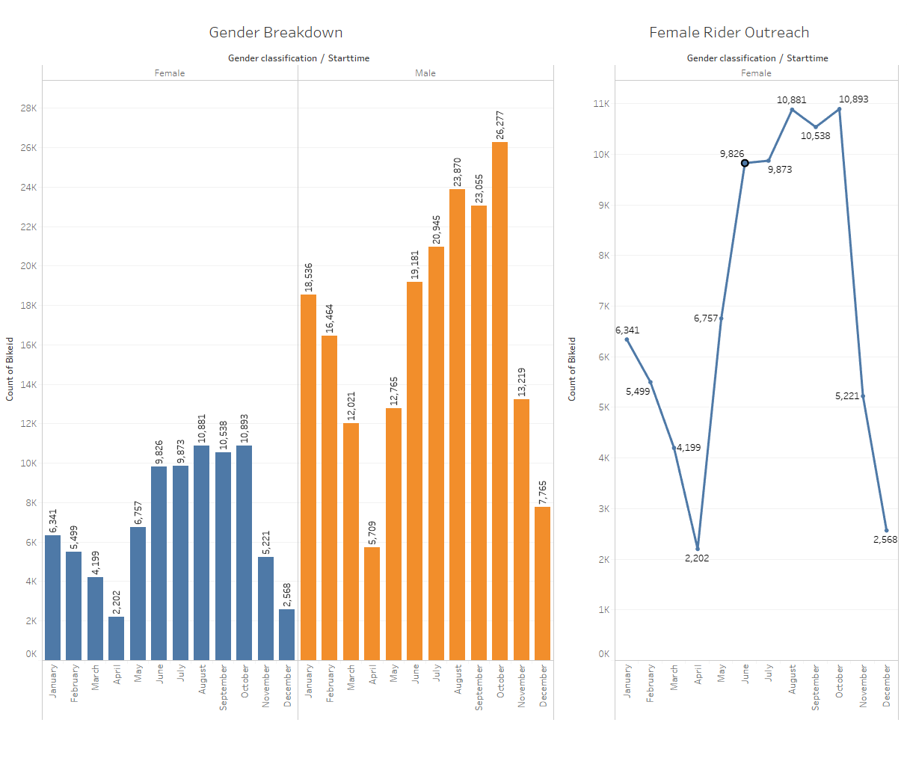
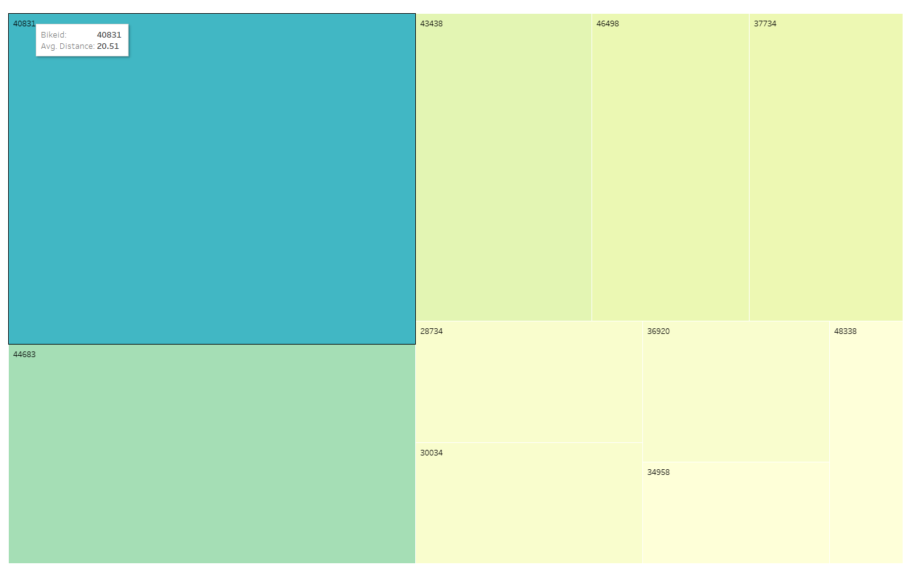

# City-Bike-Analytics - Tableau visualization

## Summary

The link to the dashboards and visualizations on Tableau Public is <https://public.tableau.com/profile/tejal5822#!/vizhome/CitiBikeAnalytics2020_16140362828250/CitiBikeAnalyticsStory>

In this project I am building dashboards and other visualizations using Tableau to relay information about the Citi Bike data from New York City.

### About the Data

Since 2013, the Citi Bike Program has implemented a robust infrastructure for collecting data on the program's utilization. Through the team's efforts, each month bike data is collected, organized, and made public on the [Citi Bike Data](https://www.citibikenyc.com/system-data) webpage.

My visualizations use data from January 2020 through December 2021.

### Instructions:
* [Instructions](Instructions/Instructions.md)

### City Bike Analysis/Observations:
1) Total trips in 2020 were 336,802. Ridership has increased from June to October. Can be because of Summer and Fall months.  Highest ridership being recorded in October with 43,537 riders.  However April is on bottom with only 9268 riders.

2) Looking at months, for all months subscribers trip count is more than customers. 
From Subscribers  view, october has topped with 30,356 trips and April being at bottom with 6692 trips.
From  Customers view,  June has topped with 17,096 trips and February at bottom with 1509 trips.

3) Despite being summer or winter month top 5 peak hours was between 15 (3 PM) and 19 (7 PM). However top most peak hour was changed, month by month.
For summer season, max riders were around 18-19 (6-7 PM), seems due to long day hours. However in winter it was around 17-18(5-6 PM).

4) Grove St PATH, Newport pkwy, Liberty Light Rail & Hamilton Park are the top start and end stations  in a sequence where Grove St PATH tops the position.

5) All bottom 10 End Stations had only one trip. For Start stations, JCBS Depot is at the bottom with only one trip.

6) In overall all months, there are more male riders than female.
Female riders count does have the same pattern as overall ridership, i.e there were more female riders from June to October and max was it in October.

7) Bike id 40831 had more trips/usage hence its the one which more likely needed a repair.

